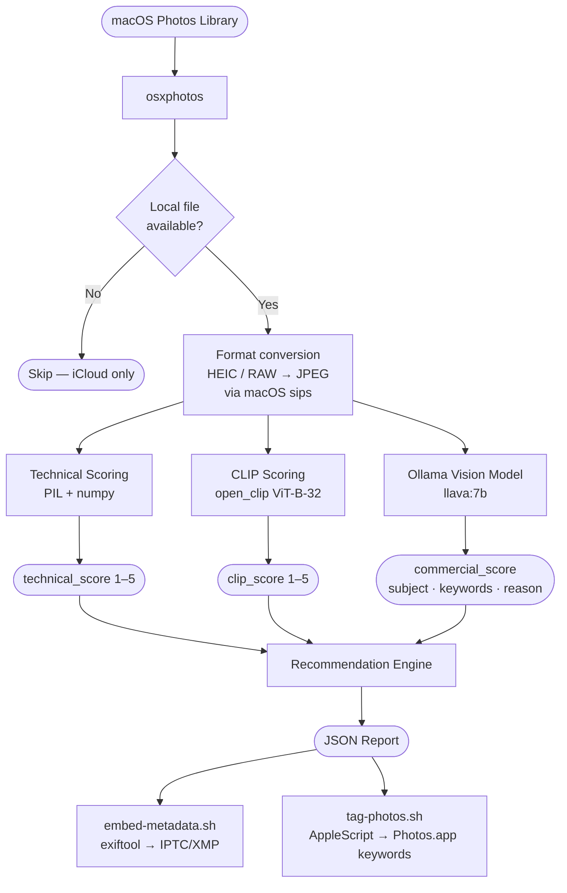
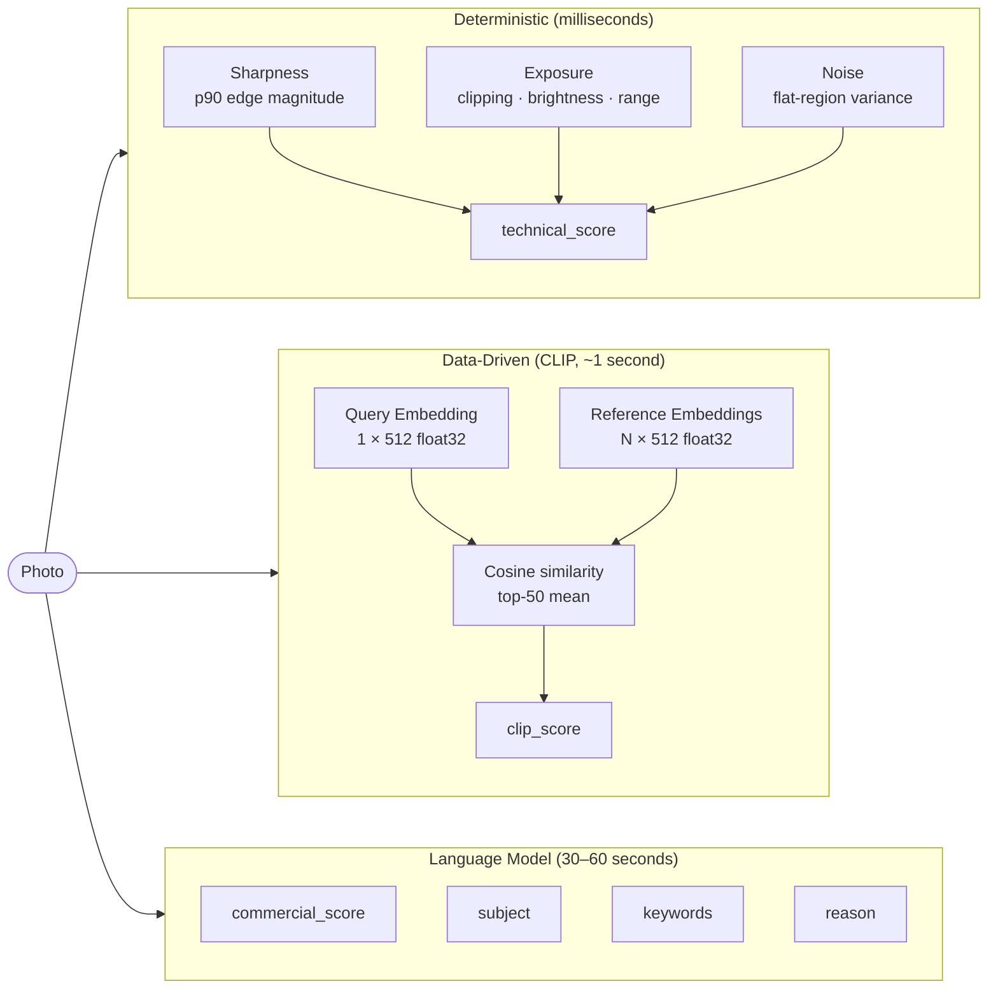
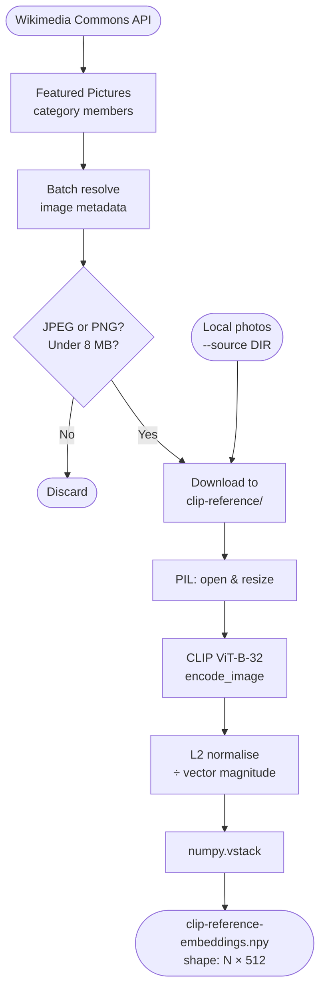
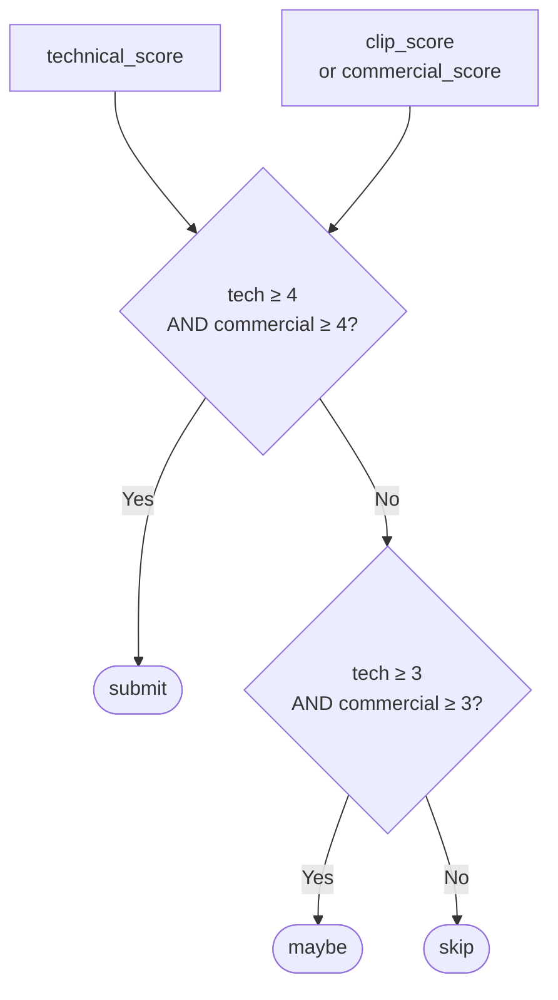
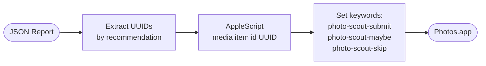

# How photo-scout Works: A Technical Deep-Dive

This document describes the full end-to-end process behind photo-scout — from reading a macOS Photos
library to producing a ranked report of stock submission candidates. It is more detailed than the
README and is intended as reference material for anyone who wants to understand the design decisions,
the algorithms, and the tradeoffs involved.

---

## The Problem

You have thousands of photos. Stock agencies like Adobe Stock and Shutterstock have strict technical
and commercial standards, and they reject the majority of submissions. Manually reviewing a library
of any size to find the best candidates is tedious, inconsistent, and time-consuming.

The goal of photo-scout is to automate the first pass: score each photo on technical quality and
commercial suitability, and produce a ranked list of the most promising candidates for human review.
Everything runs locally — no API costs, no data leaving the machine.

---

## Architecture Overview

The pipeline has three stages:

1. **Ingestion** — read the Photos library, filter, and convert formats
2. **Scoring** — assess technical quality and commercial appeal independently
3. **Output** — write a ranked JSON report; optionally embed metadata or tag photos in Photos.app



---

## Stage 1: Ingestion

### Reading the Photos Library

macOS stores its Photos library as an SQLite database bundled inside a `.photoslibrary` package.
Accessing it directly is possible but fragile — Apple changes the schema between OS versions, and
direct reads bypass iCloud sync state, album membership, and face data.

photo-scout uses [osxphotos](https://github.com/RhetTbull/osxphotos), a well-maintained Python
library that reads the Photos SQLite database safely and exposes a clean object model. Each photo is
a `PhotoInfo` object with properties like `path`, `date`, `original_filename`, `uuid`, and
`album_info`.

Key properties used:

| Property | Purpose |
| --- | --- |
| `photo.path` | Local filesystem path (None if iCloud-only) |
| `photo.original_filename` | Camera-assigned filename (e.g. `IMG_1234.HEIC`) |
| `photo.uuid` | Photos.app internal UUID — used to tag photos via AppleScript |
| `photo.date` | Date taken — used for newest-first ordering and `--since` filtering |

### iCloud-only Photos

Photos offloaded to iCloud return `None` for `photo.path`. These are silently excluded and counted
so the user knows how many were skipped. There is no programmatic way to trigger iCloud downloads
from a script — the user must download them manually in Photos.app.

### Format Conversion

Ollama vision models only accept JPEG and PNG. iPhones shoot HEIC by default; mirrorless cameras
often produce RAW files. A conversion step handles this using `sips`, the macOS built-in image
processing tool:

```bash
sips -s format jpeg /path/to/image.HEIC --out /tmp/tmpXXXX.jpg
```

The temporary JPEG is created in `/tmp`, used for all scoring, and deleted immediately afterwards.
Original files in the Photos library are never touched.

### Filtering and Ordering

Photos are sorted newest-first so that `--limit N` always selects the most recently taken photos.
Existing report entries are loaded and their `original_path` values are used to skip already-analysed
photos on subsequent runs — making the tool incrementally safe to run in batches.

---

## Stage 2: Scoring

The original design asked a single vision model to assess both technical quality (sharpness,
exposure, noise) and commercial appeal. This turned out to be a poor fit: a 7B parameter model
processes images at reduced resolution (typically 336×336 pixels) and cannot reliably distinguish
"tack sharp" from "acceptable". It also has limited understanding of what makes a photo commercially
valuable to a buyer.

The evolved design separates the two concerns and uses the right tool for each:

| Dimension | Tool | Why |
| --- | --- | --- |
| Technical quality | PIL + numpy (deterministic) | Sharpness, exposure, and noise are measurable properties, not opinions |
| Commercial appeal | CLIP similarity (data-driven) | Measures how closely the photo's subject matches accepted stock photography |
| Metadata generation | Ollama vision model | Natural language — subject description, keywords, recommendation reason |



### Technical Quality Scoring

The `_compute_technical_score()` function runs on the JPEG version of each photo at a standard
1500 px width (larger images are resized; smaller are left as-is). Three independent signals are
computed using PIL and numpy only — no additional dependencies.

#### Sharpness

A sharp image has strong, well-defined edges. PIL's `FIND_EDGES` filter applies a kernel similar to
a Laplacian, highlighting edges in the image:

```python
edges = gray.filter(ImageFilter.FIND_EDGES)
```

The key insight is to use the **90th-percentile edge magnitude** rather than the mean. The mean is
suppressed by large smooth areas — a portrait with a blurred background, a landscape with a clear
sky — making it content-dependent. The 90th percentile captures the strength of the actual
subject edges, regardless of how much smooth area surrounds them.

The result is mapped to a 1–5 score using a log scale (so the difference between a slightly soft
and very soft photo registers, not just the difference at the top):

```python
sharp = 1 + 4 * log(p90 / LOW) / log(HIGH / LOW)
```

Calibration constants `_SHARP_EDGE_LOW = 3.0` and `_SHARP_EDGE_HIGH = 50.0` can be tuned if scores
cluster too high or too low for a given library.

#### Exposure

Three sub-signals combine into a single exposure component:

- **Clipping fraction** — the proportion of pixels below 8 or above 247 (approaching the 0 or 255
  boundaries). Severe clipping means blown highlights or crushed shadows. A 12.5% clip rate drives
  this component to zero.
- **Mean brightness** — penalises images that are too dark or too bright relative to a mid-grey
  ideal. A perfectly mid-tone image scores 1.0; solid black or white scores 0.
- **Dynamic range** — standard deviation of pixel values. A photo with a wide tonal spread (shadows
  and highlights) scores higher than a flat, grey image. Saturates above a standard deviation of 55.

Weights: clipping 40 %, brightness 30 %, dynamic range 30 %.

#### Noise

Noise appears as random pixel variation in regions that should be smooth — a blue sky, a neutral
wall, skin. The scorer isolates those flat regions using the edge map (flat = edge response below
40 % of the mean), then measures the mean absolute difference between the original and a
Gaussian-blurred version:

```python
blurred = gray.filter(ImageFilter.GaussianBlur(radius=1))
diff = abs(gray_arr - blurred_arr)
noise_level = diff[flat_mask].mean()
```

In textured regions the blur difference is high regardless of noise; restricting to flat regions
makes the measurement specific to actual noise rather than detail.

#### Combining the Components

```text
technical_score = round( sharp × 0.5 + exposure × 0.3 + noise × 0.2 )
```

Sharpness is weighted most heavily because it is the most common reason stock sites reject
technically competent photos. Exposure and noise are secondary.

---

### Commercial Appeal Scoring via CLIP

CLIP (Contrastive Language-Image Pre-Training) is a model from OpenAI trained on hundreds of
millions of image–caption pairs from the internet. During training it learned to embed images and
text into the same 512-dimensional vector space — so a photo of a golden eagle and the phrase
"golden eagle in flight" land close together in that space, regardless of image style or quality.

The key property for photo-scout's use case: **images with similar subject matter have similar
embeddings**, even if they were taken by different photographers, in different lighting, with
different cameras.

#### Building the Reference Set



**Why Wikimedia Commons Featured Pictures?**

Wikimedia's Featured Pictures are hand-voted by Wikipedia editors for technical excellence —
sharp, well-exposed, well-composed, and encyclopedically interesting. This makes them a useful
proxy for stock photo quality:

- Completely free to download, no API key required
- Spans diverse subjects: nature, architecture, science, people, travel
- Genuinely high editorial bar, similar (though not identical) to commercial stock standards

The script fetches 4× the requested count to account for filtering losses: SVG diagrams, oversized
files, and media that slips through the MIME type filter are all discarded.

#### Scoring a Query Photo

At inference time, the query photo is embedded using the same CLIP model (ViT-B-32, OpenAI
pretrained weights). The embedding is L2-normalised so that cosine similarity reduces to a simple
dot product:

```python
similarities = reference_embeddings @ query_embedding.T  # shape [N]
top_k_mean = sorted(similarities)[-50:].mean()
```

The top-50 mean focuses on the most similar reference images, discarding the tail of unrelated ones.
The result is mapped to a 1–5 scale:

```python
clip_score = 1 + 4 * (mean_sim - 0.65) / (0.88 - 0.65)
```

The calibration window `[0.65, 0.88]` covers the typical range of cosine similarities between
semantically related natural images using ViT-B-32. These constants are tunable.

**What CLIP measures and what it does not:**

CLIP similarity reflects semantic subject match, not technical quality. A sharp photo and a blurry
photo of the same mountain lake will have nearly identical CLIP embeddings, because CLIP learned to
recognise "mountain lake" regardless of sharpness. Technical quality is `technical_score`'s job.

What CLIP does well: distinguishing photos whose subjects commonly appear in accepted stock
photography (landscapes, architecture, business, lifestyle, wildlife) from personal snapshots,
domestic interiors, and subjects that rarely appear in curated collections.

---

### The Ollama Vision Model

The vision model (`llava:7b` by default) now has a focused job: describe the photo in natural
language. Technical scoring has been removed from its prompt entirely. It produces:

- `commercial_score` — a 1–5 rating of commercial appeal, used as a fallback when CLIP is not
  available
- `subject` — a 5–10 word description of what is in the photo
- `keywords` — 5–10 single-word tags for IPTC metadata
- `reason` — one sentence justifying the recommendation

The model runs inference on the JPEG version of each photo at whatever resolution Ollama samples it
to (typically 336×336 px for LLaVA models). At that resolution it can describe subject matter
reliably but cannot assess fine sharpness — which is why technical scoring was moved to PIL.

---

## Stage 3: Recommendation Engine

The three scoring signals feed a deterministic rule engine with code-level floors that cannot be
overridden by model output:



When CLIP scoring is active, `clip_score` replaces `commercial_score` in these thresholds.
`overall_score` is the mean of `technical_score` and whichever commercial signal was used.

The model's own `recommendation` field (submit / maybe / skip) is parsed from the JSON response
and then checked against these floors — any model recommendation that contradicts the threshold
rules is silently corrected.

---

## Post-Analysis Workflows

The JSON report is the hub that two companion scripts read from.

### embed-metadata.sh — Preparing Files for Upload


The script reads the report, copies the original file from the Photos library to an output
directory, and uses `exiftool` to embed the model's keywords and subject description into the copy's
IPTC and XMP metadata fields. The originals in the Photos library are never modified.

`--organize` creates `submit/`, `maybe/`, and `skip/` subfolders so the output can be browsed in
Finder alongside the report.

### tag-photos.sh — Photos.app Keyword Tagging



The script reads each photo's `uuid` from the report and uses AppleScript to set a keyword on the
corresponding photo in Photos.app. The UUID is the stable internal identifier that Photos.app uses
— more reliable than filename matching.

Existing user keywords are preserved; only `photo-scout-*` prefixed keywords are replaced. After
tagging, searching for `photo-scout-submit` in Photos.app shows all candidates visually with their
full metadata visible.

> **Note:** The `add {item} to album` AppleScript verb is silently broken in Photos.app 11
> (macOS 26+). Keyword tagging is used as a reliable alternative — Smart Albums based on keyword
> filters provide the same visual browsing capability.

---

## Scoring Pipeline Summary

| Score | Source | Measures | Speed |
| --- | --- | --- | --- |
| `technical_score` | PIL + numpy | Sharpness, exposure, noise | < 1 second |
| `clip_score` | CLIP ViT-B-32 | Subject similarity to reference stock photos | ~1 second |
| `commercial_score` | Ollama llava:7b | Commercial appeal (fallback when CLIP absent) | 30–60 seconds |
| `overall_score` | Computed | Mean of technical + best commercial signal | — |

The Ollama model is the bottleneck. On Apple Silicon with 8 GB unified memory, `llava:7b`
processes approximately one photo per minute. The PIL and CLIP steps add only a few seconds to each
photo's total processing time.

---

## Design Decisions Worth Noting

**Why not use a larger model?** The tool is local-first by design. Sending photos to a cloud API
(Claude, GPT-4V) would give better commercial appeal judgement, but it would mean uploading
personal photos to a third party, incurring per-image costs, and removing the ability to run
offline. The CLIP approach recovers much of the quality signal without those tradeoffs.

**Why Wikimedia Commons rather than actual stock sites?** Scraping accepted stock photos is
legally murky and technically fragile. Wikimedia Featured Pictures are freely licensed, openly
accessible via API, and editorially curated to a comparable standard. The reference set can be
supplemented with personal known-good stock photos using `build_reference.py --source`.

**Why p90 rather than mean for sharpness?** The mean edge response is suppressed by large smooth
areas — a portrait against a blurred background or a landscape with a clear sky. The 90th
percentile focuses on the strongest edges in the frame, reducing content dependency.

**Why separate technical from commercial?** A 7B vision model processes at ~336 px and cannot
reliably distinguish fine sharpness levels. Assigning it a task that requires pixel-level
analysis produced inconsistent results. Moving to PIL metrics produced deterministic,
well-calibrated scores in milliseconds.

**Why still run the Ollama model?** Keywords and subject descriptions require natural language
generation — something deterministic tools cannot produce. The vision model's `commercial_score`
also serves as a useful fallback when the CLIP reference set is not available, and its `reason`
text explains the commercial recommendation in human-readable terms.

---

## Calibration Notes

Several constants in the codebase are calibrated against typical images and may need tuning:

| Constant | File | Default | Effect of raising |
| --- | --- | --- | --- |
| `_SHARP_EDGE_LOW` | `photo_scout.py` | 3.0 | More photos score above minimum |
| `_SHARP_EDGE_HIGH` | `photo_scout.py` | 50.0 | Harder to reach maximum sharpness score |
| `_NOISE_FLAT_HIGH` | `photo_scout.py` | 6.0 | More tolerant of noise |
| `_SIM_LOW` | both files | 0.65 | CLIP scores start higher |
| `_SIM_HIGH` | both files | 0.88 | Harder to reach maximum CLIP score |

If all `technical_score` values cluster at 4–5, lower `_SHARP_EDGE_HIGH`.
If all `clip_score` values cluster at 1–2, lower `_SIM_LOW`.
The reference set size also affects CLIP score distribution — more diverse reference photos
produce more stable, well-spread scores.
